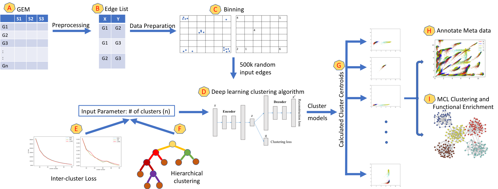

# EdgeScaping

This file details the different codes that we utlized to create the results for EdgeScaping.

The requirements include:
Python
IDEC
MCL
KINC

USAGE

1. The data is pre-processed into binned image based array using:

'<python GEM_binning.py>'

2. The output file then becomes the input to the algorithm IDEC. We have used the default architecure available at the IDEC GitHub:

'<git clone https://github.com/XifengGuo/IDEC.git>'

The instructions for installing are usage are included in the README. We suggest integrating the GEM_binning.py function within the input of IDEC if your data is large and needs to be processed in chunks. Some of the ways we have identified the ideal value for n (number of clusters) is detailed in the paper.

3. The cluster centroids along with the metadata can be visualized using the annotation file.

'<python plot_metadata.py>'

4. Classify the KINC edges onto the respective clusters using the KINC alogirthm. To obtain KINC edge install and run KINC (https://github.com/SystemsGenetics/KINC.R)

'<python kinc_edges_clustermodel.py>'

5. Calculate the Euclidean distance on the identified genes to form the connected network.

'<python Euc_Mi_bimodalgenes.py>'

6. Run MCL clustering to obtain modules with the eucliden distance network. (https://micans.org/mcl/)
